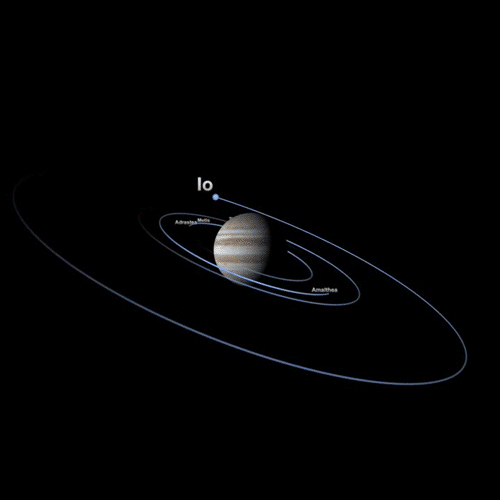

<p align="center"></p>

<h1 align="center">Moons Mapper API</h1>

<h3 align="center">Esta API de satélites tem o objetivo de mapear  luas, satélites naturais são corpos celestes que possuem órbita atrelada a um planeta. Ou seja, enquanto os planetas orbitam em torno de uma estrela, os satélites naturais fazem o mesmo movimento só que em torno de um planeta.
 <a href="https://www.iau2006.org/"usando como base organizacional um sistema de CRUD
<p align="center">
 
<a href="https://github.com/Mario23junior/Moons-mapper-API/actions/workflows/Maven.yml/badge.svg?branch=dev" target="_blank"> [](https://github.com/Mario23junior/Moons-mapper-API)
<a href="https://en.wikipedia.org/wiki/Representational_state_transfer"></a>
</p>
  
## Primeiro execute o maven 

## 🚀 Começando

Algums parametros de ação são necessarios para a execução
### 📋 Pré-requisitos


Você pode esta alterando o tamanho do print direto no codigo


### 🔧 Instalação

Uma série de exemplos passo-a-passo que informam o que você deve executar para ter um ambiente de desenvolvimento em execução.

Diga como essa etapa será:

```
java -jar target/MoonsMapped.jar

```
 
## Uso local

```
localhost:8080/api/moons/
```

## Resultado dos dados da API

```json
{
    "id": 12,
    "name": "lua",
    "planetaMae": "Terra",
    "semieixoMaior": "72323",
    "pressaoAtmosferica": "7",
    "massa": 6,
    "periodoDeRotacao": "6",
    "periodoOrbital": "6",
    "inclinacao": "6",
    "velocidadeOrbitalMedia": 66.0
}

```

## 🛠️ Construído com

Mencione as ferramentas que você usou para criar seu projeto

* [Java 17](http://www.dropwizard.io/1.0.2/docs/)
* [Spring boot](https://spring.io/projects/spring-boot)
* [H2](https://www.h2database.com/html/main.html)
* [openJDK](https://maven.apache.org/)
 
## 📄 Licença

Este projeto está sob a licença (GNU GPLv3) - [GNU GPLv3.md](https://www.gnu.org/licenses/gpl-3.0.pt-br.html)
